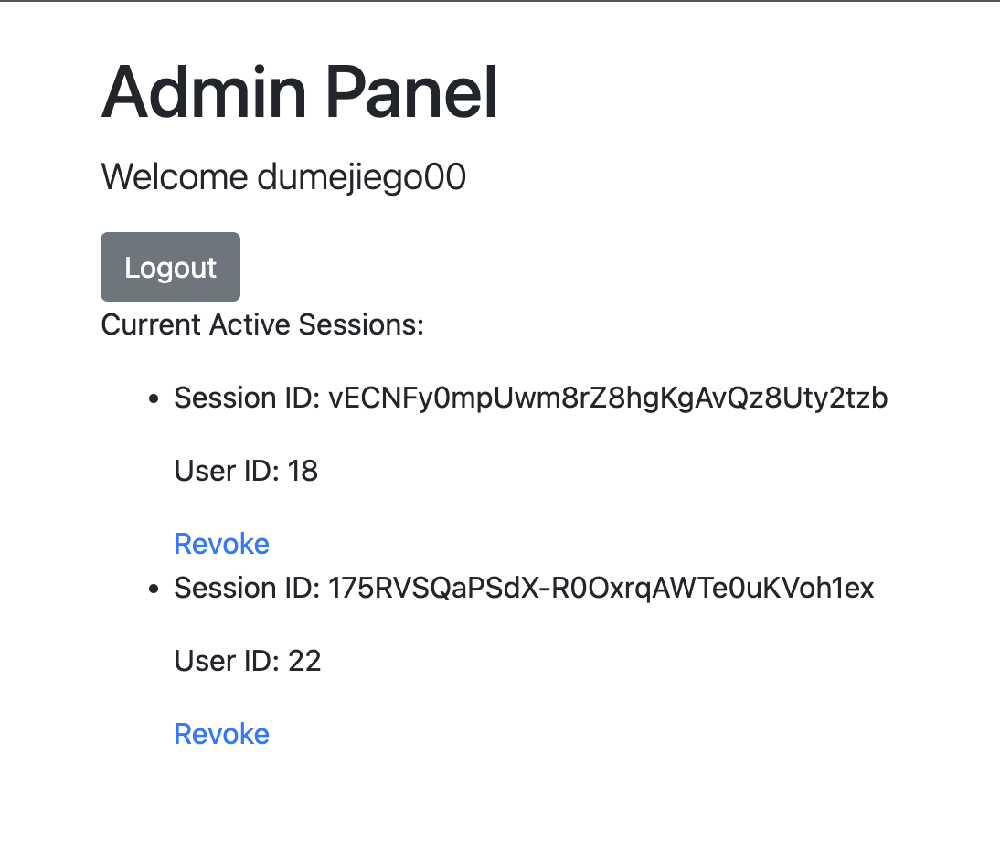

# **Auth Module Setup Guide**

## **Overview**

This project provides a modular authentication system, supporting multiple authentication strategies including:
- **Email + Password**
- **GitHub Login**
- **Google Login**


Additionally, the system includes:
- Admin and Non-Admin user roles with separate dashboards





- Email verification for email + password logins


- Database functions with Jest test cases for unit testing

### **Tech Stack**
- **Backend:** Express.js
- **Language:** TypeScript
- **Template Engine:** EJS
- **Testing:** Jest
- **Authentication:** Passport.js (GitHub, Google, Local)
- **Database:** MySQL (FreeDB / Local)
- **Session Management:** Express Session (Redis optional)

---

## **Installation and Setup**

### **Prerequisites**
- [Node.js installed](https://nodejs.org/en/download/) (LTS version recommended)
- [MySQL (Local)](https://dev.mysql.com/downloads/installer/) for local setup and [MySQL Workbench Community Edition](https://dev.mysql.com/downloads/workbench/) for database management


### **1. Clone the repository**

```bash
git clone git@github.com:dumejiego00/auth-module.git
cd auth-module
```

### **2. Install dependencies**

Run the following command to install both regular and development dependencies:

```bash
npm install
```

### **3. Build the TypeScript project**

Since this project is built using **TypeScript**, you need to transpile it to JavaScript first. Run the following command:

```bash
npm run build
```

This will transpile your TypeScript files into JavaScript files inside the `dist` directory.

Alternatively, you can run the development version directly with:

```bash
npm run dev
```

This will start the application using **ts-node** and you don't need to manually build the TypeScript files.

### **4. Set up environment variables**

Create a `.env` file in the project root (copy from `.env.example` and fill in values). Here are the key variables and their descriptions:

```dotenv
# JWT Secret for Token Generation (Required for Email Verification)
JWT_SECRET=your-secret-key-here

# Local MySQL Database Settings (For Local Development)
DB_LOCAL_USER=your-local-db-user
DB_LOCAL_HOST=localhost
DB_LOCAL_PASSWORD=your-local-db-password
DB_LOCAL_DATABASE=your-local-db-name

# Remote MySQL Database Settings (For FreeDB or other remote MySQL setups)
DB_FREE_HOST=your-freedb-host
DB_FREE_USER=your-freedb-user
DB_FREE_PASSWORD=your-freedb-password
DB_FREE_DATABASE=your-freedb-database

# Test Database for Jest Testing
DB_LOCAL_TEST_DATABASE=your-local-test-db-name

# Email Settings (For Email Verification and Notifications)
EMAIL_USER=your-email@example.com
EMAIL_PASS=your-email-password

# OAuth Credentials for GitHub Authentication
GH_CLIENT_ID=your-github-client-id
GH_CLIENT_SECRET=your-github-client-secret
CALLBACK_GITHUB_URL=your-github-callback-url

# OAuth Credentials for Google Authentication
GOOGLE_CLIENT_ID=your-google-client-id
GOOGLE_CLIENT_SECRET=your-google-client-secret
CALLBACK_GOOGLE_URL=your-google-callback-url
```

#### **Key Notes:**
- **JWT_SECRET**: This secret key is used for generating JWT tokens required for email verification and other features.
- **DB_LOCAL_**: Configuration for your local MySQL database setup (for development or testing).
- **DB_FREE_**: Configuration for connecting to FreeDB (or any other remote MySQL database you use).
- **EMAIL_USER / EMAIL_PASS**: These credentials are used to send verification emails for the email + password login system. Ensure that you have enabled "less secure apps" or set up an app password if using services like Gmail.
- **OAuth credentials**: Set up OAuth credentials for GitHub and Google login functionality.

---

### **5. Run the server**

To run the application:

```bash
npm start
```

This will run your application on the specified port. If not specified, it defaults to port 8000.

Alternatively, you can run the development version with:

```bash
npm run dev
```

This will allow you to start the server without the need to manually transpile TypeScript files.

---

## **Testing**

To run tests (database-related tests using Jest):

```bash
npm test
```

Ensure your **test database** is configured correctly in the `.env` file with the following variable:

```dotenv
DB_LOCAL_TEST_DATABASE=your-local-test-db-name
```

---

## **Session Management (Optional: Redis)**

By default, the application uses **MemoryStore** for sessions. This is not recommended for production due to performance and security reasons. **Redis** can be used for session storage.

---

## **Remote Database Setup (FreeDB)**

- The application is set up for **FreeDB** as a remote database host. 
- **Note**: FreeDB is suitable for small-scale projects or testing, but **it is not recommended for robust or production-grade connections**. For more reliable database hosting, consider alternative providers or self-hosting.

---

## **Future Enhancements**
- **External Session Storage**: External storage (such as Redis) can be used for session management to improve scalability.
- **Remote Database Hosting**: While the system uses FreeDB for remote MySQL hosting, consider alternative services for production environments.

---

## **Conclusion**

This modularized authentication system supports multiple login strategies and roles. The pages are simply designed and serve as a **starting point for your application**. Make sure to configure your environment variables correctly, especially for email and OAuth credentials. For production environments, consider using Redis for session management and securing your database connection.

---
